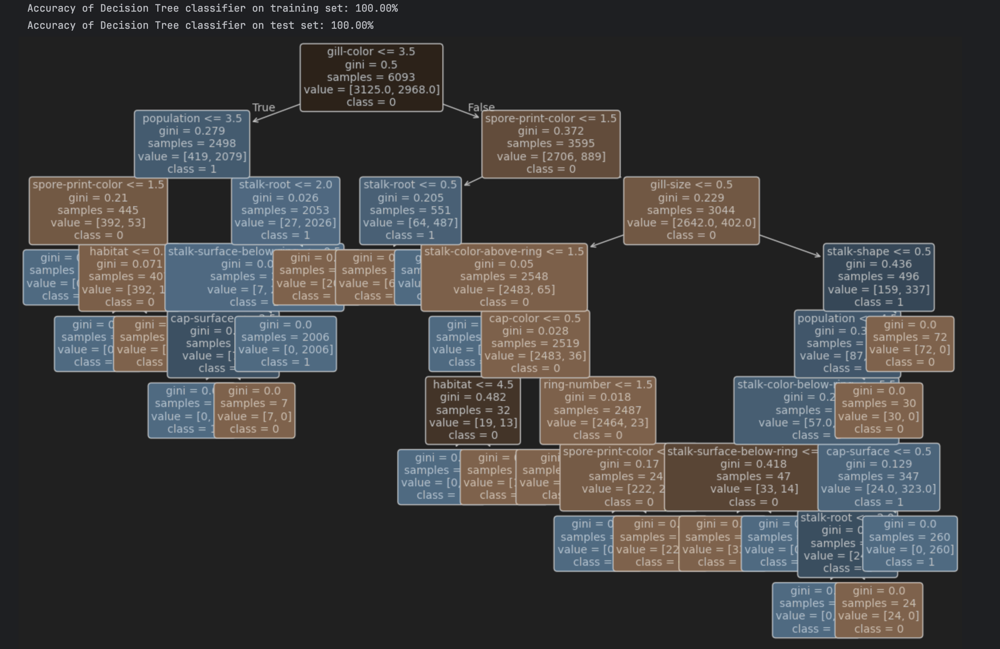
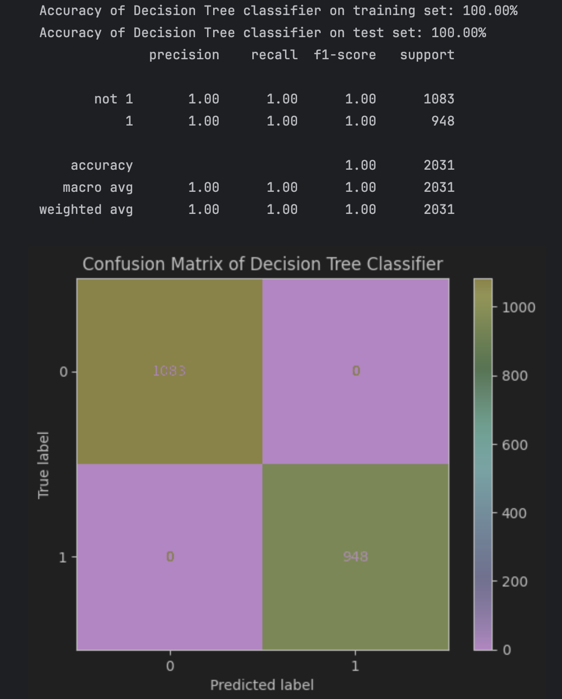
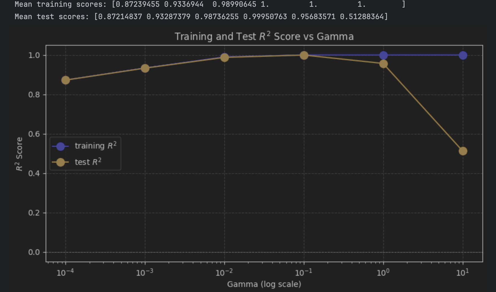

# ML_Classification_Pipeline
Exploring Decision Tree and Support Vector Machines (SVM) for classification projects. 

## DecisionTree 
In the classify_poisonous_mushroom jupyter notebook, I explored using a **Decision Tree Classifier** to determine feature importance in a dataset. 

**Evaluation**
For the classification model, I evaluated performance using metrics such as precision, recall, F1 score, and accuracy while making sure we have equal class distribution. 

Using the UCI Mushroom dataset, the Decision Tree classifier achieved 100% accuracy on both the training and test data, which led to concerns of overfitting. 

To avoid overfitting and achieve generalization, we can consider below approaches: 

- Control the **maximum depth** of the tree
- Average multiple trees to improve generalization, such as **Random Forests** or **Gradient Boosted Trees** 

## Support Vector Machines

When creating the Support Vector Machines, I explored the influence of different **gamma** values on the model performance. 

- **Small gamma**: Larger similarity radius which results in more points being grouped together and smoother decision boundaries.
- **Larger value of gamma**: Points have to be very close to be considered similar, resulting in more complex, tightly constrained decision boundaries. 
- To visualize the influence of gamma, I plotted the **validation curves** to show sensitivity to changes in gamma values.

A 3-fold **cross-validation** method was used to give a more stable performance estimate and improve generalization. 

